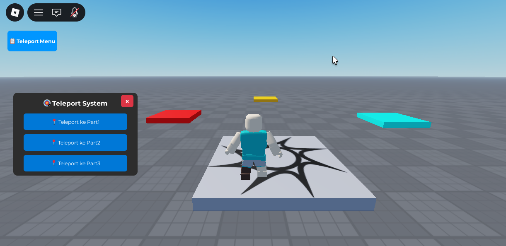

# Roblox Teleport System

Sistem teleport dengan GUI yang memungkinkan pemain untuk teleport ke 3 lokasi berbeda (Part1, Part2, dan Part3) di Roblox Studio.

## 📺 Preview & Visualisasi

### GUI Teleport System


---

## 📋 Fitur

- ✅ GUI interaktif dengan 3 tombol teleport
- ✅ Trigger Button untuk show/hide GUI
- ✅ Mendeteksi Part1, Part2, dan Part3 di Workspace
- ✅ Teleport otomatis ke lokasi yang dipilih
- ✅ Error handling jika part tidak ditemukan
- ✅ Smooth animation saat teleport
- ✅ Hover effect pada tombol
- ✅ Close button untuk menutup GUI

---

## 🎮 Cara Menggunakan

### Setup di Roblox Studio

1. **Buat 3 Part di Workspace:**
   - Nama: `Part1`, `Part2`, `Part3`
   - Posisikan di lokasi yang berbeda

2. **Tambahkan Script:**
   - Copy script `TeleportGui.lua` ke dalam **StarterGui** → **LocalScript**
   - Copy script `TeleportService.lua` ke dalam **ServerScriptService** → **Script** (opsional)

3. **Jalankan Game:**
   - Tekan tombol **Play** (▶️)
   - **Trigger Button** akan muncul di top-left corner
   - Klik tombol untuk membuka/menutup **Teleport Menu**
   - Pilih lokasi teleport dengan klik salah satu dari 3 tombol

---

## 📁 Struktur File

```
roblox-teleport-system/
├── README.md
├── TeleportGui.lua          # Script GUI (StarterGui LocalScript)
├── TeleportService.lua      # Script Service (ServerScriptService Script)
├── roblox-teleport-system.png  # Screenshot GUI
└── docs/
    └── SETUP_GUIDE.md       # Panduan setup lengkap & customization
```

---

## 🚀 Quick Start

### Step 1: Buat Part di Workspace
```
Part1, Part2, Part3
```

### Step 2: Tambah LocalScript di StarterGui
Copy kode dari `TeleportGui.lua` ke script baru

### Step 3: Play & Test
Tekan Play, GUI akan muncul otomatis

---

## 🎨 GUI Components

| Komponen | Fungsi |
|----------|--------|
| **Trigger Button** | Tombol untuk membuka/menutup menu utama |
| **Title Label** | Menampilkan "🎯 Teleport System" |
| **3 Tombol Teleport** | Teleport ke Part1, Part2, Part3 |
| **Close Button (×)** | Menutup seluruh GUI |

---

## 🔧 Customization

### Ubah Warna GUI

Di `TeleportGui.lua`, cari dan ubah nilai `Color3.fromRGB()`:

```lua
-- Background frame
mainFrame.BackgroundColor3 = Color3.fromRGB(45, 45, 45)

-- Button color
button.BackgroundColor3 = Color3.fromRGB(0, 120, 215)

-- Trigger button color
triggerButton.BackgroundColor3 = Color3.fromRGB(0, 150, 255)
```

**Kode warna RGB yang umum:**
- 🔵 Biru: `(0, 120, 215)`
- 🔴 Merah: `(220, 53, 69)`
- 🟢 Hijau: `(40, 167, 69)`
- 🟡 Kuning: `(255, 193, 7)`
- 🟣 Ungu: `(111, 66, 193)`

### Ubah Ukuran GUI

Di `TeleportGui.lua`:
```lua
local GUI_SIZE = UDim2.new(0, 300, 0, 200) -- Ubah 300 (lebar) dan 200 (tinggi)
```

### Ubah Posisi Trigger Button

```lua
-- Top-Left (default)
triggerButton.Position = UDim2.new(0, 20, 0, 20)

-- Top-Right
triggerButton.Position = UDim2.new(1, -140, 0, 20)

-- Bottom-Left
triggerButton.Position = UDim2.new(0, 20, 1, -70)

-- Bottom-Right
triggerButton.Position = UDim2.new(1, -140, 1, -70)
```

### Tambah Part Baru

1. Buat Part4, Part5, dst di Workspace
2. Di `TeleportGui.lua`, tambah line baru:
```lua
createButton("Button4", "📍 Teleport ke Part4", "Part4", 200)
```

3. Ubah ukuran GUI agar semua tombol terlihat:
```lua
local GUI_SIZE = UDim2.new(0, 300, 0, 250) -- Tambah height
```

---

## 🐛 Troubleshooting

### ❌ GUI tidak muncul
- ✅ Pastikan LocalScript ada di **StarterGui**
- ✅ Lihat **View → Output** untuk error messages
- ✅ Cek apakah ada syntax error di script

### ❌ Trigger Button tidak muncul
- ✅ Trigger Button harus di-parent ke `screenGui`, bukan `mainFrame`
- ✅ Cek Position dan Size tombol
- ✅ Lihat console untuk pesan error

### ❌ Teleport tidak bekerja
- ✅ Pastikan Part1, Part2, Part3 **PERSIS** ada di Workspace
- ✅ Nama part **case-sensitive** (Part1 ≠ part1 ≠ PART1)
- ✅ Lihat **Output console** untuk warning messages

### ❌ Part tidak terdeteksi
```
⚠️ Part Part1 tidak ditemukan di Workspace!
```
- ✅ Buat Part dengan nama yang sama di Workspace
- ✅ Jangan ada spasi atau typo di nama
- ✅ Pastikan part berada di hierarchy **Workspace**, bukan di folder lain

---

## 📖 Dokumentasi Lengkap

Baca `docs/SETUP_GUIDE.md` untuk:
- Setup step-by-step dengan screenshot
- Penjelasan kode detail
- Advanced customization
- Sound effects & animation
- Tips debugging

---

## 💡 Tips & Tricks

### Tambah Sound Effect saat Teleport

Di `TeleportGui.lua`, sebelum `humanoidRootPart.CFrame = ...`:

```lua
local sound = Instance.new("Sound")
sound.SoundId = "rbxassetid://12221967" -- Teleport sound
sound.Volume = 0.5
sound.Parent = workspace
sound:Play()
game:GetService("Debris"):AddItem(sound, 1)
```

### Tambah Loading Effect

```lua
-- Disable buttons saat loading
button.Enabled = false

wait(0.5) -- Delay 0.5 detik

-- Enable kembali
button.Enabled = true
```

### Custom Emoji di Tombol

Ubah text tombol:
```lua
createButton("Button1", "⭐ Teleport ke Part1", "Part1", 50)
createButton("Button2", "🎮 Teleport ke Part2", "Part2", 100)
createButton("Button3", "🚀 Teleport ke Part3", "Part3", 150)
```

---

## 🤝 Kontribusi

Anda bebas mengmodifikasi dan mengembangkan sistem ini!

### Ideas untuk development:
- [ ] Hotkey untuk teleport cepat (Q, E, F)
- [ ] Animation saat teleport
- [ ] Teleport history/recent locations
- [ ] Permissions system (admin only)
- [ ] Cooldown timer
- [ ] Multiple part groups

---

## 📄 License

Free to use and modify for your Roblox projects!

---

## ✨ Credits

**Dibuat untuk:** Roblox Studio dengan Lua  
**Status:** ✅ Ready to use  
**Last Updated:** 2026-07-08

---

**Enjoy your Teleport System! 🎮✨**
